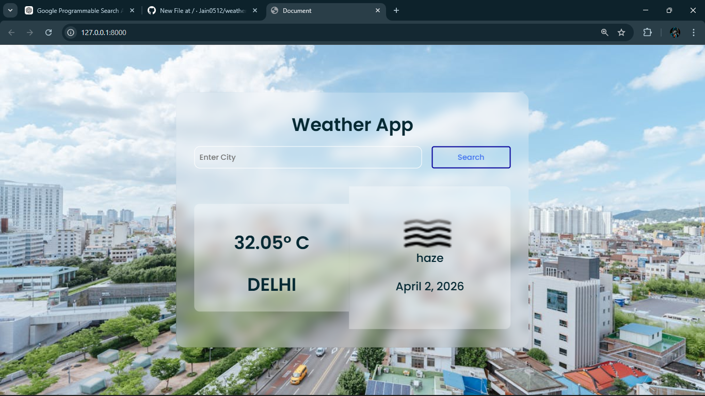

# 🌦️ Weather App (Django + API)

A modern and responsive **Weather Web Application** built using **Django**, which provides real-time weather updates along with dynamic background images based on the searched city.

---

## 🚀 Live Demo

👉 https://weather-app-8ngu.onrender.com

---

## 📌 Features

* 🌍 Search weather by city name
* 🌡️ Real-time temperature display
* ☁️ Weather condition (clouds, haze, etc.)
* 📅 Current date display
* 🖼️ Dynamic background images (via Pexels API)
* 💻 Clean Glassmorphism UI
* 📱 Fully responsive design
* ⚡ Fast and lightweight

---

## 🛠️ Tech Stack

* **Frontend:** HTML, CSS
* **Backend:** Django (Python)

* **APIs Used:**

  * OpenWeatherMap API (for weather data)
  * Pexels API (for background images)

---

## 📂 Project Structure

```
Weather/
│── myapp/
│── static/
│── templates/
│── Weather/
│── manage.py
│── requirements.txt
│── Procfile
```

---

## ⚙️ Installation & Setup

1. Clone the repository:

```
git clone https://github.com/Jain0512/weather-app.git
cd weather-app
```

2. Create virtual environment:

```
python -m venv myenv
myenv\Scripts\activate   (Windows)
```

3. Install dependencies:

```
pip install -r requirements.txt
```

4. Run server:

```
python manage.py runserver
```

---

## 🔑 API Setup

### 1. OpenWeather API

* Get API key from: https://openweathermap.org/api
* Replace in `views.py`

### 2. Pexels API

* Get API key from: https://www.pexels.com/api/
* Replace in `views.py`

---

## 📸 Screenshots




---

## 🌐 Deployment

Deployed using **Render**

Steps:

* Push code to GitHub
* Connect repo with Render
* Add build command:

```
pip install -r requirements.txt
```

* Start command:

```
gunicorn Weather.wsgi
```

---

## 🧠 Learnings

* Django project deployment
* API integration
* Static files handling (WhiteNoise)
* UI/UX design improvements
* Git & GitHub workflow

---

## 📌 Future Improvements

* 📊 Add 5-day forecast
* 🌙 Dark mode toggle
* 📍 Location-based weather
* 🎨 More UI animations

---


## ⭐ Show your support

If you like this project:

* ⭐ Star the repo
* 🍴 Fork it
* 📢 Share it

---
